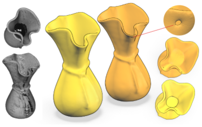

##SFU Visual Computing Workshop

    <!-- Menu -->
    <ol class="carousel-indicators">
        <li data-target="#carousel" data-slide-to="0" class="active"></li>
        <li data-target="#carousel" data-slide-to="1"></li>
    </ol>

    <!-- Items -->
    
            
        

            
        

        

            
        

    
 
  <a class="left carousel-control" href="#carousel" role="button" data-slide="prev">
    
    Previous
  </a>
  <a class="right carousel-control" href="#carousel" role="button" data-slide="next">
    
    Next
  </a>

<figure class="fourth">
  
</figure>

<table class="tg">
<thead>
  <tr>
    <th class="tg-0pky"></th>
    <th class="tg-c3ow" colspan="5">Map</th>
  </tr>
</thead>
<tbody>
  <tr>
    <td class="tg-0pky">Losses</td>
    <td class="tg-c3ow">Normal</td>
    <td class="tg-c3ow">Roughness</td>
    <td class="tg-c3ow">Diffuse</td>
    <td class="tg-c3ow">Specular</td>
    <td class="tg-c3ow">Rendered</td>
  </tr>
  <tr>
    <td class="tg-0pky">L1</td>
    <td class="tg-c3ow">s10</td>
    <td class="tg-c3ow"></td>
    <td class="tg-c3ow"></td>
    <td class="tg-c3ow"></td>
    <td class="tg-c3ow"></td>
  </tr>
  <tr>
    <td class="tg-0pky">SSIM</td>
    <td class="tg-c3ow">s12</td>
    <td class="tg-c3ow"></td>
    <td class="tg-c3ow"></td>
    <td class="tg-c3ow"></td>
    <td class="tg-c3ow"></td>
  </tr>
  <tr>
    <td class="tg-0pky">L1 + Content</td>
    <td class="tg-c3ow">s41</td>
    <td class="tg-c3ow"></td>
    <td class="tg-c3ow"></td>
    <td class="tg-c3ow"></td>
    <td class="tg-c3ow"></td>
  </tr>
  <tr>
    <td class="tg-0pky">L1 + Attn</td>
    <td class="tg-c3ow">s73</td>
    <td class="tg-c3ow"></td>
    <td class="tg-c3ow"></td>
    <td class="tg-c3ow"></td>
    <td class="tg-c3ow"></td>
  </tr>
</tbody>
</table>
        

